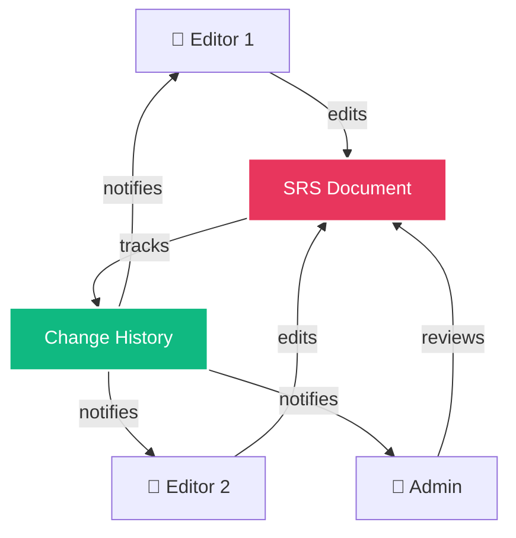

## Overview

FSD Movil enables seamless team collaboration on SRS documentation through real-time editing, change tracking, commenting, and structured approval workflows. Multiple team members can work together on documents while maintaining complete visibility and control.

## Collaboration Features

<CardGroup cols={2}>
  <Card title="Multi-User Editing" icon="users">
    Multiple team members can work on documents simultaneously with role-based permissions.
  </Card>
  
  <Card title="Change Tracking" icon="clock-rotate-left">
    All modifications are logged with user attribution, timestamps, and change descriptions.
  </Card>
  
  <Card title="Comments & Mentions" icon="comments">
    Add inline comments, tag team members with @mentions, and discuss requirements.
  </Card>
  
  <Card title="Approval Workflows" icon="circle-check">
    Structured review and approval process with stakeholder sign-off tracking.
  </Card>
</CardGroup>

## Real-Time Collaboration

FSD Movil's collaboration system is designed for team efficiency:



<Note>
Future versions will support WebSocket-based real-time editing where users see each other's changes as they type. The current implementation uses a polling mechanism for updates.
</Note>

## Change Tracking

Every modification to an SRS document is recorded in the change history:

### What Gets Tracked

<Tabs>
  <Tab title="Content Changes">
    **Document Content**
    - Requirement additions, edits, deletions
    - Section text modifications
    - Description updates
    - Diagram changes
  </Tab>
  
  <Tab title="Metadata Changes">
    **Document Metadata**
    - Status transitions (Draft → Review → Approved)
    - Version updates
    - Title and description changes
    - Tag and category modifications
  </Tab>
  
  <Tab title="Structural Changes">
    **Document Structure**
    - Section reordering
    - Requirement code renumbering
    - New section creation
    - Section deletions
  </Tab>
</Tabs>

### Change History Format

Each change entry includes:

<ResponseField name="changeId" type="string">
  Unique identifier for the change
</ResponseField>

<ResponseField name="userId" type="string">
  ID of the user who made the change
</ResponseField>

<ResponseField name="userName" type="string">
  Full name of the user (e.g., "John Doe")
</ResponseField>

<ResponseField name="timestamp" type="datetime">
  ISO 8601 timestamp of the change
</ResponseField>

<ResponseField name="changeType" type="string">
  Type: `create`, `update`, `delete`, `status_change`
</ResponseField>

<ResponseField name="description" type="string">
  Human-readable description of what changed
</ResponseField>

<ResponseField name="previousValue" type="any">
  Value before the change (for updates and deletions)
</ResponseField>

<ResponseField name="newValue" type="any">
  Value after the change (for creates and updates)
</ResponseField>

## Comments and Mentions

### Adding Comments

Team members can add comments to specific requirements or sections:

<Steps>
  <Step title="Select content">
    Click or tap on the requirement, section, or diagram you want to comment on.
  </Step>
  
  <Step title="Add comment">
    Select **Add Comment** from the context menu or tap the comment icon.
  </Step>
  
  <Step title="Write feedback">
    Enter your comment text. Use `@username` to mention and notify specific team members.
  </Step>
  
  <Step title="Submit">
    Post the comment. Mentioned users receive a notification.
  </Step>
</Steps>

### @Mentions

Mention team members to draw their attention:

```
@johndoe Can you review the authentication requirements in FR-001?

@janedoe Please update NFR-003 with the updated latency requirements.
```

<Tip>
Mentioned users receive both in-app notifications and email alerts (if enabled in their settings).
</Tip>

### Comment Threads

Comments support threaded discussions:

- **Reply to comments**: Create conversation threads
- **Resolve discussions**: Mark comments as resolved when addressed
- **Edit comments**: Update your comments within 5 minutes of posting
- **Delete comments**: Remove your own comments before replies are added

## Approval Workflows

FSD Movil implements a structured approval process for SRS documents:

### Standard Approval Flow

<Steps>
  <Step title="Draft Creation">
    Editor creates the initial document draft. Status: **Draft**
  </Step>
  
  <Step title="Submit for Review">
    Editor marks the document as ready. Status changes to **Review**
  </Step>
  
  <Step title="Team Review">
    Team members review and provide feedback through comments. Changes are requested if needed.
  </Step>
  
  <Step title="Revision Cycle">
    If changes are requested, document returns to **Draft** status. Editor addresses feedback and resubmits.
  </Step>
  
  <Step title="Stakeholder Approval">
    Administrator or designated approver reviews the document. If satisfactory, status changes to **Approved**
  </Step>
  
  <Step title="Publication">
    Approved document is published for external distribution. Status: **Published**
  </Step>
</Steps>

### Approval Permissions

<AccordionGroup>
  <Accordion title="Who Can Approve">
    Document approval permissions:
    - **Workspace Administrators**: Can approve any document
    - **Project Owners**: Can approve documents in their projects
    - **Designated Approvers**: Custom role assigned per project
    - **Editors**: Cannot approve (can only submit for review)
    - **Viewers**: Cannot approve or submit
  </Accordion>
  
  <Accordion title="Approval Requirements">
    Before a document can be approved:
    - All required sections must be completed
    - No unresolved critical comments
    - At least one review cycle completed
    - All requirements have valid codes (FR-###, NFR-###)
    - Diagrams render correctly
  </Accordion>
  
  <Accordion title="Rejection and Revision">
    When a document is rejected:
    - Status returns to **Draft**
    - Rejection reason is logged in change history
    - Original submitter is notified
    - Comments indicate required changes
    - Document can be resubmitted after revisions
  </Accordion>
</AccordionGroup>

## Activity Feed

Track all collaboration activities in real-time:

```dart
// Example activity feed entries
[
  {
    "userId": "user123",
    "userName": "John Doe",
    "action": "commented",
    "target": "FR-001: User Authentication",
    "timestamp": "2024-03-10T15:30:00Z",
    "preview": "Should we add 2FA support?"
  },
  {
    "userId": "user456",
    "userName": "Jane Smith",
    "action": "updated",
    "target": "NFR-002: Performance Requirements",
    "timestamp": "2024-03-10T14:20:00Z",
    "preview": "Updated response time from 3s to 2s"
  },
  {
    "userId": "admin789",
    "userName": "Admin User",
    "action": "approved",
    "target": "SRS Document v1.2",
    "timestamp": "2024-03-10T10:00:00Z"
  }
]
```

## Notifications

Stay informed about document activities:

<CardGroup cols={2}>
  <Card title="In-App Notifications" icon="bell">
    Real-time notifications within the application for:
    - @mentions in comments
    - Document status changes
    - New comments on your content
    - Approval requests
  </Card>
  
  <Card title="Email Notifications" icon="envelope">
    Configurable email alerts for:
    - Daily activity digest
    - Urgent @mentions
    - Approval requests
    - Document published
  </Card>
</CardGroup>

## Best Practices

<AccordionGroup>
  <Accordion title="Effective Commenting">
    - Be specific: Reference exact requirement codes (e.g., "In FR-003...")
    - Be constructive: Suggest improvements, not just problems
    - Use @mentions: Tag relevant team members for context
    - Resolve when done: Mark comments as resolved after addressing
    - Stay professional: Maintain respectful tone in all feedback
  </Accordion>
  
  <Accordion title="Change Management">
    - Small, frequent updates: Easier to track and review than large changes
    - Descriptive commit messages: Explain why changes were made
    - Review before submitting: Self-review reduces revision cycles
    - Communicate major changes: Use comments to explain significant updates
    - Track decisions: Document why certain requirements were added or removed
  </Accordion>
  
  <Accordion title="Approval Process">
    - Set clear criteria: Define what "ready for review" means
    - Timely reviews: Respond to review requests within 24-48 hours
    - Constructive feedback: Explain what needs to change and why
    - Single approver: Designate one person as final approver to avoid conflicts
    - Version milestones: Create new versions for significant document updates
  </Accordion>
  
  <Accordion title="Team Communication">
    - Regular syncs: Schedule periodic document review meetings
    - Centralize discussions: Use comments instead of external messages
    - Document decisions: Add comments explaining requirement rationale
    - Status updates: Keep team informed about document progress
    - Celebrate completion: Acknowledge when documents are approved
  </Accordion>
</AccordionGroup>

## Collaboration API

While direct collaboration endpoints are not exposed in the current API routes, collaboration features are integrated into the document management API:

```dart
// Get document with comments and change history
final response = await ApiService.dio.get(
  ApiRoutes.document(docId),
  queryParameters: {'include': 'comments,changes'},
);

// Returns document with embedded collaboration data:
// - comments: Array of comment objects
// - changes: Change history entries
// - approvals: Approval status and approver info
```

## Future Enhancements

Planned collaboration features (from README.md roadmap):

<CardGroup cols={2}>
  <Card title="WebSocket Real-Time" icon="bolt">
    Live cursor positions, character-by-character sync, and instant updates
  </Card>
  
  <Card title="Advanced Roles" icon="user-shield">
    Custom role definitions beyond Administrator/Editor/Viewer
  </Card>
  
  <Card title="Conflict Resolution" icon="code-merge">
    Automatic merge and manual conflict resolution for simultaneous edits
  </Card>
  
  <Card title="Video Calls" icon="video">
    Integrated video conferencing for document review sessions
  </Card>
</CardGroup>

## Related Documentation

<CardGroup cols={2}>
  <Card title="Version Control" icon="code-branch" href="/features/version-control">
    Learn about revision tracking and document history
  </Card>
  <Card title="SRS Documents" icon="file-lines" href="/features/srs-documents">
    Understand SRS document structure and creation
  </Card>
  <Card title="Workspaces" icon="users" href="/features/workspaces">
    Manage team access and permissions
  </Card>
  <Card title="Projects" icon="folder-open" href="/features/projects">
    Organize documents within projects
  </Card>
</CardGroup>
