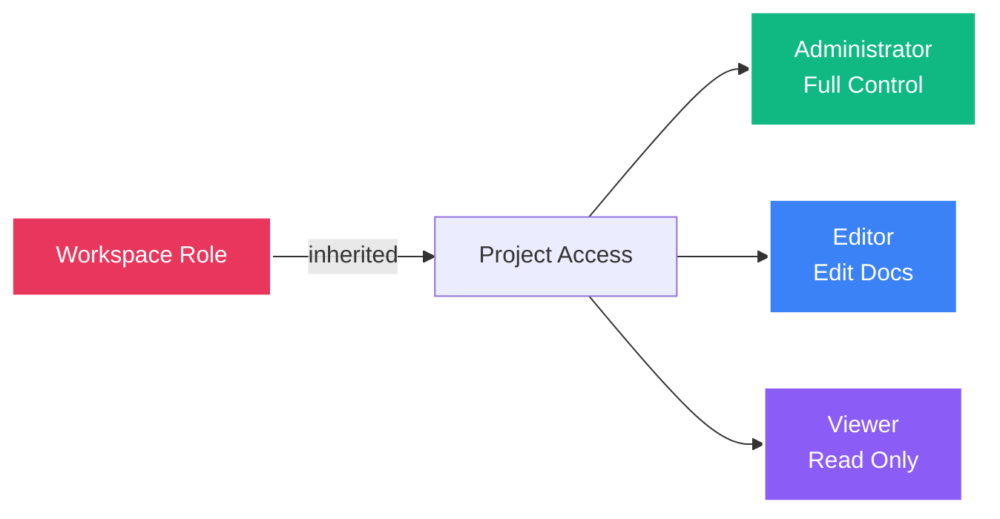

## Overview

Projects in FSD Movil are containers for software development initiatives within a workspace. Each project can contain multiple SRS documents, requirements, team members, and track the complete documentation lifecycle from planning through delivery.

## Project Lifecycle

<Steps>
  <Step title="Planning">
    Create the project, define scope, and invite stakeholders. Set up initial structure and documentation templates.
  </Step>
  
  <Step title="Documentation">
    Generate SRS documents, define requirements, create diagrams, and establish specifications.
  </Step>
  
  <Step title="Review">
    Collaborate with team members to review and refine documentation. Track changes and incorporate feedback.
  </Step>
  
  <Step title="Approval">
    Submit documents for stakeholder approval. Track approval status and manage revision cycles.
  </Step>
  
  <Step title="Delivery">
    Export final documentation to DOCX format. Archive completed documents and prepare for implementation.
  </Step>
</Steps>

## Project Structure

Each project consists of:

<CardGroup cols={2}>
  <Card title="Basic Information" icon="info-circle">
    - Project name and description
    - Status (active, archived, completed)
    - Created/updated timestamps
    - Owner and primary contacts
  </Card>
  
  <Card title="SRS Documents" icon="file-lines">
    - Multiple documentation versions
    - Requirement specifications
    - System diagrams (Mermaid)
    - Revision history
  </Card>
  
  <Card title="Team Members" icon="users">
    - Assigned collaborators
    - Role-based access from workspace
    - Activity tracking
    - Contribution metrics
  </Card>
  
  <Card title="Metadata" icon="tags">
    - Custom tags and categories
    - Project type/domain
    - Target platform
    - Priority level
  </Card>
</CardGroup>

## Creating a Project

<Tabs>
  <Tab title="From Dashboard">
    Create a new project from the main dashboard:
    
    1. Navigate to your workspace
    2. Tap **New Project** or the + button
    3. Fill in project details:
       - **Name**: Clear, descriptive project identifier
       - **Description**: Project scope and objectives
       - **Type**: Web, Mobile, Desktop, etc.
       - **Status**: Active (default)
    4. Assign team members (optional)
    5. Create project
  </Tab>
  
  <Tab title="From Workspace">
    Create directly within a workspace:
    
    1. Open the target workspace
    2. Navigate to the Projects section
    3. Select **Add Project**
    4. Configure project settings
    5. Set initial permissions
    6. Save and begin documentation
  </Tab>
</Tabs>

## Project API Integration

Projects are managed through the REST API defined in `lib/config/api_routes.dart`:

### List Projects

```dart
// Fetch all projects accessible to the current user
final response = await ApiService.dio.get(ApiRoutes.projects);
final projects = response.data as List;

// Returns array of projects with:
// - id, name, description
// - workspaceId, workspaceName
// - status (active, archived, completed)
// - documentCount, requirementCount
// - createdAt, updatedAt
```

### Get Project Details

```dart
// Fetch detailed project information
final response = await ApiService.dio.get(
  ApiRoutes.project(projectId),
);

final project = response.data;
// Includes:
// - Full project metadata
// - List of SRS documents
// - Team members and collaborators
// - Recent activity
```

### Create Project

```dart
// Create a new project in a workspace
final response = await ApiService.dio.post(
  ApiRoutes.projects,
  data: {
    'workspaceId': workspaceId,
    'name': 'Mobile Banking App',
    'description': 'Cross-platform mobile banking application',
    'type': 'mobile',
    'status': 'active',
  },
);

final newProject = response.data;
```

### Update Project

```dart
// Update project information
final response = await ApiService.dio.patch(
  ApiRoutes.project(projectId),
  data: {
    'name': 'Updated Project Name',
    'description': 'Updated description',
    'status': 'archived',
  },
);
```

## Project Status Management

Projects can have three status values:

<Tabs>
  <Tab title="Active">
    ### Active
    
    Project is currently under active development or documentation:
    
    - ✅ Full editing capabilities
    - ✅ Create new documents
    - ✅ Invite collaborators
    - ✅ Export and share
    
    This is the default status for new projects.
  </Tab>
  
  <Tab title="Archived">
    ### Archived
    
    Project is on hold or temporarily inactive:
    
    - ✅ View existing content
    - ✅ Export documents
    - ❌ Create new documents
    - ❌ Edit existing content
    
    <Note>
    Archived projects can be reactivated at any time by changing status back to "active".
    </Note>
  </Tab>
  
  <Tab title="Completed">
    ### Completed
    
    Project has finished and documentation is finalized:
    
    - ✅ Read-only access
    - ✅ Export final documentation
    - ✅ View as reference
    - ❌ Any modifications
    
    <Tip>
    Completed projects serve as templates and reference materials for future projects.
    </Tip>
  </Tab>
</Tabs>

## Team Collaboration

Projects inherit permissions from the parent workspace:



<AccordionGroup>
  <Accordion title="Administrator Access">
    Workspace administrators have full project control:
    - Create, edit, and delete projects
    - Manage project settings and metadata
    - Archive or complete projects
    - Assign project-specific roles
    - Delete projects (with confirmation)
  </Accordion>
  
  <Accordion title="Editor Access">
    Workspace editors can manage project content:
    - Edit project details (name, description)
    - Create and modify SRS documents
    - Add requirements and diagrams
    - Export documentation
    - Cannot delete projects or change critical settings
  </Accordion>
  
  <Accordion title="Viewer Access">
    Workspace viewers have read-only project access:
    - View project information
    - Read SRS documents
    - Export documents to DOCX
    - View revision history
    - Cannot make any changes
  </Accordion>
</AccordionGroup>

## Project Organization

### Tags and Categories

Organize projects with custom tags:

- **Domain**: Web, Mobile, Desktop, IoT, Cloud
- **Technology**: Flutter, React, Node.js, Python
- **Priority**: High, Medium, Low
- **Phase**: Planning, Development, Testing, Production
- **Client**: Internal, External, Partner

### Filtering and Search

Quickly find projects using:

- Status filters (active, archived, completed)
- Date range (created, updated)
- Workspace selection
- Tag-based filtering
- Full-text search in names and descriptions

## Project Templates

<Note>
Future versions of FSD Movil will support project templates, allowing you to create new projects based on standardized structures for common project types.
</Note>

Planned template types:
- Mobile Application Project
- Web Platform Project
- API/Backend Service Project
- Desktop Application Project
- IoT/Embedded System Project

## Best Practices

<CardGroup cols={2}>
  <Card title="Clear Naming" icon="tag">
    Use descriptive, consistent naming conventions. Include project type or client identifier when helpful.
  </Card>
  
  <Card title="Regular Updates" icon="clock">
    Keep project status current. Archive inactive projects to maintain clean workspace organization.
  </Card>
  
  <Card title="Documentation First" icon="file-lines">
    Create SRS documents early in the project lifecycle. Update them as requirements evolve.
  </Card>
  
  <Card title="Team Communication" icon="comments">
    Use comments and revision notes to communicate changes. Tag team members for important updates.
  </Card>
</CardGroup>

## Related Documentation

<CardGroup cols={2}>
  <Card title="Workspaces" icon="building" href="/features/workspaces">
    Understand workspace organization and role-based access
  </Card>
  <Card title="SRS Documents" icon="file-lines" href="/features/srs-documents">
    Learn about creating and managing SRS documentation
  </Card>
  <Card title="Projects API" icon="code" href="/api/projects">
    View the complete projects API reference
  </Card>
  <Card title="Collaboration" icon="handshake" href="/features/collaboration">
    Explore team collaboration features
  </Card>
</CardGroup>
