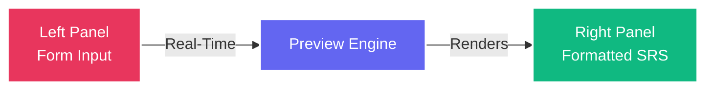
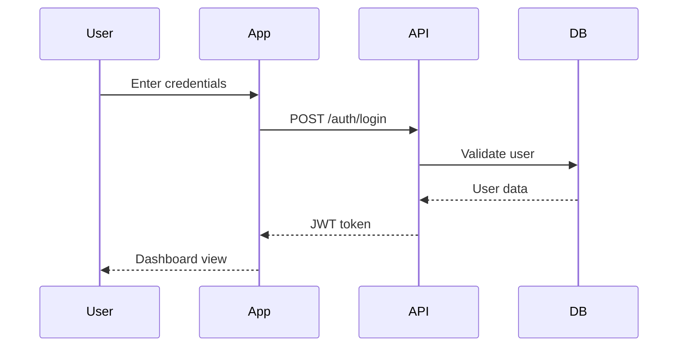
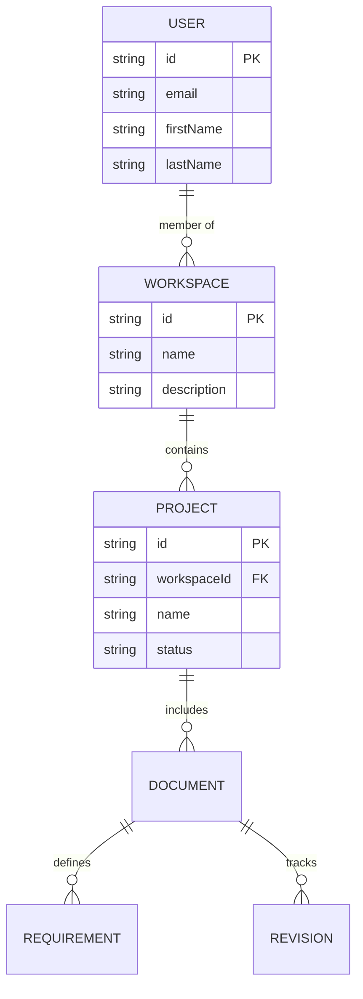

## Overview

FSD Movil's SRS (Software Requirements Specification) document generation is the platform's core feature. It provides structured forms, real-time preview, automated diagram generation, and professional DOCX export for IEEE-standard compliant requirements documentation.

## Document Architecture

As described in the project README, FSD Movil uses a **two-panel SPA interface**:

<CardGroup cols={2}>
  <Card title="Left Panel" icon="pen-to-square">
    **Structured Input Forms**
    - Project overview and scope
    - Functional requirements (FR-001, FR-002...)
    - Non-functional requirements (NFR-001...)
    - System constraints and assumptions
    - Use cases and scenarios
  </Card>
  
  <Card title="Right Panel" icon="eye">
    **Real-Time Preview**
    - Live document rendering
    - Formatted SRS output
    - Mermaid diagrams
    - Professional styling
    - Export-ready view
  </Card>
</CardGroup>

## Document Sections

A complete SRS document includes:

<AccordionGroup>
  <Accordion title="1. Introduction">
    **Purpose and Scope**
    - Product overview
    - Intended audience
    - Document conventions
    - Project scope statement
    - References to related documents
  </Accordion>
  
  <Accordion title="2. Overall Description">
    **Product Perspective**
    - System context and interfaces
    - User characteristics
    - Operating environment
    - Design and implementation constraints
    - Assumptions and dependencies
  </Accordion>
  
  <Accordion title="3. System Features">
    **Functional Requirements**
    - Feature descriptions
    - User stories and use cases
    - Input/output specifications
    - Functional requirement codes (FR-001, FR-002...)
  </Accordion>
  
  <Accordion title="4. Non-Functional Requirements">
    **Quality Attributes**
    - Performance requirements (NFR-001...)
    - Security requirements
    - Usability standards
    - Reliability and availability
    - Maintainability and scalability
  </Accordion>
  
  <Accordion title="5. System Models">
    **Visual Diagrams**
    - Sequence diagrams (Mermaid)
    - Entity-relationship diagrams (Mermaid)
    - Use case diagrams
    - System architecture
    - Data flow diagrams
  </Accordion>
</AccordionGroup>

## Creating an SRS Document

<Steps>
  <Step title="Navigate to project">
    Open the project where you want to create the SRS document. Ensure you have Editor or Administrator permissions.
  </Step>
  
  <Step title="Create new document">
    Tap **New Document** or the + button in the documents section. Select **SRS Document** as the template type.
  </Step>
  
  <Step title="Fill structured forms">
    Complete the form fields in the left panel:
    - Basic document metadata (title, version, date)
    - Introduction and scope
    - System overview
    - Requirements (functional and non-functional)
  </Step>
  
  <Step title="Add requirements">
    Create individual requirements with unique codes:
    ```
    FR-001: User login with email and password
    FR-002: Password reset via email link
    NFR-001: Login response time < 2 seconds
    NFR-002: 99.9% uptime availability
    ```
  </Step>
  
  <Step title="Generate diagrams">
    Add Mermaid diagrams directly in the document:
    - Sequence diagrams for workflow visualization
    - ER diagrams for data model representation
    - Use the visual editor or write Mermaid syntax directly
  </Step>
  
  <Step title="Preview and refine">
    View the live preview in the right panel. Make adjustments as needed. The preview updates in real-time as you edit.
  </Step>
  
  <Step title="Save and version">
    Save the document. FSD Movil automatically creates a revision entry in the version history.
  </Step>
</Steps>

## Real-Time Preview

The right panel provides an instant preview of your SRS document:



<Note>
Changes in the input forms are reflected immediately in the preview, allowing you to see exactly how the final document will appear.
</Note>

## Mermaid Diagram Support

FSD Movil automatically generates and renders Mermaid diagrams within SRS documents:

### Sequence Diagrams

Visualize user interactions and system workflows:



### Entity-Relationship Diagrams

Model database structure and relationships:



## Document Status Workflow

<Tabs>
  <Tab title="Draft">
    ### Draft Status
    
    Initial document creation state:
    
    - ✅ Fully editable
    - ✅ Add/modify requirements
    - ✅ Update diagrams
    - ✅ Save changes
    - ⚠️ Not ready for review
    
    Continue editing until document is complete.
  </Tab>
  
  <Tab title="Review">
    ### Review Status
    
    Document is ready for team review:
    
    - ✅ Viewable by all team members
    - ✅ Comments and feedback enabled
    - ✅ Change tracking active
    - ❌ No direct edits (must return to Draft)
    
    Team members review and provide feedback.
  </Tab>
  
  <Tab title="Approved">
    ### Approved Status
    
    Document has been approved by stakeholders:
    
    - ✅ Final version ready
    - ✅ Export to DOCX available
    - ✅ Reference for implementation
    - ❌ Cannot be edited
    
    <Note>
    To make changes to an approved document, create a new revision and start the workflow again.
    </Note>
  </Tab>
  
  <Tab title="Published">
    ### Published Status
    
    Official release for external distribution:
    
    - ✅ Read-only
    - ✅ DOCX export
    - ✅ PDF generation (future)
    - ✅ Archived for compliance
    - ❌ No modifications
  </Tab>
</Tabs>

## DOCX Export

Export your SRS documents to professional Microsoft Word format:

<Steps>
  <Step title="Open document">
    Navigate to the SRS document you want to export.
  </Step>
  
  <Step title="Select export">
    Tap the **Export** button in the document toolbar.
  </Step>
  
  <Step title="Choose format">
    Select **DOCX** format. The backend generates a formatted Word document with:
    - Professional styling and formatting
    - Table of contents with page numbers
    - Rendered diagrams as images
    - Proper heading hierarchy
    - Consistent fonts and spacing
  </Step>
  
  <Step title="Download">
    The DOCX file is generated and downloaded to your device. Open it in Microsoft Word or compatible editors.
  </Step>
</Steps>

<Tip>
Exported DOCX files maintain full formatting and can be further customized in Word if needed.
</Tip>

## Requirements Management

### Requirement Codes

All requirements follow a standardized coding system:

- **FR-###**: Functional Requirements (FR-001, FR-002, FR-003...)
- **NFR-###**: Non-Functional Requirements (NFR-001, NFR-002...)

### Requirement Structure

Each requirement includes:

<ParamField path="code" type="string" required>
  Unique identifier (e.g., FR-001, NFR-003)
</ParamField>

<ParamField path="title" type="string" required>
  Brief requirement description
</ParamField>

<ParamField path="description" type="string" required>
  Detailed requirement specification
</ParamField>

<ParamField path="priority" type="string">
  Priority level: High, Medium, or Low
</ParamField>

<ParamField path="status" type="string">
  Status: Proposed, Approved, Implemented, Verified
</ParamField>

## API Integration

SRS documents are managed through the API (lib/config/api_routes.dart:17-19):

```dart
// List documents for a project
final response = await ApiService.dio.get(ApiRoutes.documents);

// Get specific document
final doc = await ApiService.dio.get(ApiRoutes.document(docId));

// Get document revisions
final revisions = await ApiService.dio.get(
  ApiRoutes.documentRevisions(docId),
);
```

See the [Documents API Reference](/api/documents) for complete endpoint documentation.

## Related Documentation

<CardGroup cols={2}>
  <Card title="Version Control" icon="code-branch" href="/features/version-control">
    Learn about document revision tracking and history
  </Card>
  <Card title="Collaboration" icon="handshake" href="/features/collaboration">
    Explore real-time collaboration features
  </Card>
  <Card title="Projects" icon="folder-open" href="/features/projects">
    Understand project organization and structure
  </Card>
  <Card title="API Reference" icon="code" href="/api/documents">
    View the complete documents API documentation
  </Card>
</CardGroup>
