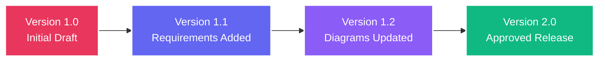

## Overview

FSD Movil provides comprehensive version control for SRS documents, tracking every change with full audit trails, allowing rollback to previous versions, and maintaining complete document history for compliance and auditing.

## Revision Tracking

Every time an SRS document is saved, FSD Movil creates a revision entry:



## Data Model

As documented in README.md, the revision hierarchy follows:

```
User → Workspace → Project → Document (SRS) → Revision
```

Each revision is a complete snapshot of the document at a specific point in time.

## Revision Structure

Every revision includes:

<ResponseField name="revisionId" type="string">
  Unique identifier for this revision
</ResponseField>

<ResponseField name="documentId" type="string">
  ID of the parent SRS document
</ResponseField>

<ResponseField name="version" type="string">
  Semantic version number (e.g., "1.0", "1.1", "2.0")
</ResponseField>

<ResponseField name="createdBy" type="object">
  User who created this revision
  <Expandable title="User object">
    <ResponseField name="userId" type="string">
      User ID
    </ResponseField>
    <ResponseField name="userName" type="string">
      Full name (e.g., "John Doe")
    </ResponseField>
    <ResponseField name="email" type="string">
      User email address
    </ResponseField>
  </Expandable>
</ResponseField>

<ResponseField name="createdAt" type="datetime">
  ISO 8601 timestamp of revision creation
</ResponseField>

<ResponseField name="changeDescription" type="string">
  Summary of changes in this revision
</ResponseField>

<ResponseField name="documentContent" type="object">
  Complete document snapshot including:
  - All sections and text
  - Requirements (functional and non-functional)
  - Diagrams and visual content
  - Metadata and tags
</ResponseField>

<ResponseField name="status" type="string">
  Document status at time of revision: `draft`, `review`, `approved`, `published`
</ResponseField>

<ResponseField name="changeCount" type="number">
  Number of modifications since previous revision
</ResponseField>

## Accessing Revision History

### Via API

Retrieve the complete revision history for a document:

```dart lib/config/api_routes.dart:19
// Fetch all revisions for a document
final response = await ApiService.dio.get(
  ApiRoutes.documentRevisions(documentId),
);

final revisions = response.data as List;
// Returns array of revision objects sorted by creation date (newest first)
```

### Via UI

<Steps>
  <Step title="Open document">
    Navigate to the SRS document you want to view history for.
  </Step>
  
  <Step title="Access history">
    Tap the **History** or **Versions** button in the document toolbar.
  </Step>
  
  <Step title="Browse revisions">
    View the list of all revisions with:
    - Version number
    - Author name
    - Creation timestamp
    - Change description
    - Change count
  </Step>
  
  <Step title="View revision">
    Select any revision to view its full content as it appeared at that time.
  </Step>
</Steps>

## Version Numbering

FSD Movil follows semantic versioning for document revisions:

<Tabs>
  <Tab title="Major Versions">
    ### Major Versions (X.0)
    
    Increment major version for:
    - Initial document creation (1.0)
    - Document approval and publication
    - Significant structural changes
    - Major requirement additions or removals
    
    Examples: 1.0, 2.0, 3.0
    
    <Note>
    Major version changes typically coincide with formal approval and release milestones.
    </Note>
  </Tab>
  
  <Tab title="Minor Versions">
    ### Minor Versions (X.Y)
    
    Increment minor version for:
    - Requirement updates and refinements
    - New diagrams or sections
    - Significant content edits
    - Moving between draft and review status
    
    Examples: 1.1, 1.2, 1.3
    
    <Tip>
    Minor versions represent incremental improvements within a major release cycle.
    </Tip>
  </Tab>
</Tabs>

## Comparing Revisions

Compare any two revisions to see what changed:

<Steps>
  <Step title="Select revisions">
    In the history view, select two revisions to compare (e.g., v1.1 and v1.3).
  </Step>
  
  <Step title="View diff">
    The comparison view highlights:
    - **Added content** in green
    - **Removed content** in red
    - **Modified content** in yellow
    - Unchanged sections are collapsed
  </Step>
  
  <Step title="Navigate changes">
    Use the diff navigator to jump between changes quickly.
  </Step>
</Steps>

## Rolling Back to Previous Versions

<Warning>
Rollback creates a new revision with the content from the selected previous version. The revision history is preserved — no data is deleted.
</Warning>

To restore a previous version:

<Steps>
  <Step title="View history">
    Open the document revision history.
  </Step>
  
  <Step title="Select version">
    Choose the revision you want to restore.
  </Step>
  
  <Step title="Initiate rollback">
    Tap **Restore This Version** or **Rollback to X.Y**.
  </Step>
  
  <Step title="Confirm">
    Review the confirmation dialog showing:
    - Current version
    - Target version
    - What will change
  </Step>
  
  <Step title="Create new revision">
    Confirm the rollback. A new revision is created with:
    - Content from the selected previous version
    - New version number (increments from current)
    - Change description: "Rolled back to version X.Y"
  </Step>
</Steps>

Example rollback flow:
- Current version: 1.5
- Rollback to: 1.2
- New revision created: 1.6 (with content from 1.2)
- All versions (1.0 through 1.6) remain in history

## Audit Trail

Revision history serves as a complete audit trail for compliance:

### What's Auditable

<CardGroup cols={2}>
  <Card title="Change Attribution" icon="user-check">
    Every revision records who made the change and when
  </Card>
  
  <Card title="Content Snapshots" icon="camera">
    Complete document content preserved for every revision
  </Card>
  
  <Card title="Status Transitions" icon="arrow-right-arrow-left">
    Track document workflow from draft through approval to publication
  </Card>
  
  <Card title="Approval Records" icon="stamp">
    Record who approved each version and when
  </Card>
</CardGroup>

### Compliance Reports

Generate audit reports showing:
- Complete revision timeline
- User contributions and activity
- Approval and sign-off records
- Document evolution over time

<Note>
Audit trails are especially important for regulated industries (healthcare, finance, government) where documentation compliance is legally required.
</Note>

## Automatic vs Manual Revisions

<Tabs>
  <Tab title="Automatic Revisions">
    ### Automatic Revisions
    
    Created automatically when:
    - Document status changes (Draft → Review → Approved)
    - Major content sections are added or removed
    - Document is submitted for approval
    - Document is published
    
    Automatic revisions increment the minor version number.
  </Tab>
  
  <Tab title="Manual Revisions">
    ### Manual Revisions
    
    Created explicitly by users:
    - Clicking **Save as New Version**
    - Adding a version tag or milestone
    - Creating a named snapshot (e.g., "Client Review Draft")
    
    Manual revisions allow custom version numbers and descriptions.
  </Tab>
</Tabs>

## Best Practices

<AccordionGroup>
  <Accordion title="Version Naming">
    - Use clear, descriptive change descriptions
    - Reference specific requirements that changed (e.g., "Updated FR-003 authentication flow")
    - Indicate the purpose (e.g., "Client review version", "Final approval draft")
    - Include ticket or issue numbers if using external tracking
  </Accordion>
  
  <Accordion title="Revision Frequency">
    - Save revisions at logical milestones, not after every minor edit
    - Create a revision before submitting for review
    - Always create a revision when changing document status
    - Version major structural changes separately from content updates
  </Accordion>
  
  <Accordion title="Using Rollback">
    - Only rollback when necessary — revisions are permanent records
    - Document why you're rolling back in the change description
    - Verify the rollback version is correct before confirming
    - Communicate rollbacks to team members who may have referenced newer versions
  </Accordion>
  
  <Accordion title="Archiving Old Versions">
    - Keep all versions for compliance — don't delete revision history
    - Mark superseded major versions as "archived" for clarity
    - Export important milestone versions to DOCX for offline backup
    - Maintain at least 3-5 major versions in active history
  </Accordion>
</AccordionGroup>

## API Reference

The revision API endpoint is defined in lib/config/api_routes.dart:19:

```dart
static String documentRevisions(String id) => '/documents/$id/revisions';
```

### Get Document Revisions

```dart
// Fetch all revisions for a document
GET /documents/{documentId}/revisions

// Response:
[
  {
    "revisionId": "rev_abc123",
    "version": "1.2",
    "createdBy": {
      "userId": "user123",
      "userName": "John Doe",
      "email": "john@example.com"
    },
    "createdAt": "2024-03-10T15:30:00Z",
    "changeDescription": "Updated authentication requirements",
    "status": "review",
    "changeCount": 7
  },
  // ... more revisions
]
```

For detailed API documentation, see [Documents API Reference](/api/documents).

## Related Documentation

<CardGroup cols={2}>
  <Card title="SRS Documents" icon="file-lines" href="/features/srs-documents">
    Learn about creating and managing SRS documents
  </Card>
  <Card title="Collaboration" icon="handshake" href="/features/collaboration">
    Understand team collaboration and change tracking
  </Card>
  <Card title="Documents API" icon="code" href="/api/documents">
    View the complete documents and revisions API
  </Card>
  <Card title="Projects" icon="folder-open" href="/features/projects">
    Organize documents within projects
  </Card>
</CardGroup>
