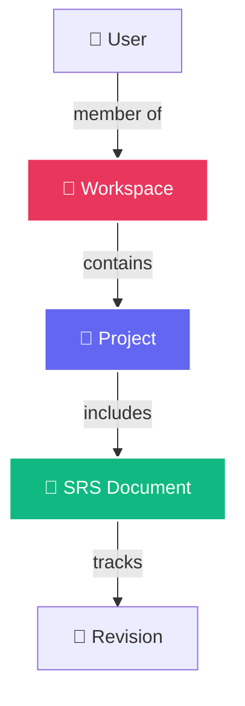

## Overview

Workspaces are the top-level organizational unit in FSD Movil. They provide a collaborative environment where teams can manage multiple projects, control member access, and maintain organized documentation workflows.

## Workspace Hierarchy



## Role-Based Access Control

FSD Movil implements three distinct roles within workspaces:

<Tabs>
  <Tab title="Administrator">
    ### Administrator
    
    Full control over the workspace:
    
    - ✅ Create, edit, and delete projects
    - ✅ Invite and remove members
    - ✅ Assign and change member roles
    - ✅ Create and modify SRS documents
    - ✅ Approve document revisions
    - ✅ Configure workspace settings
    - ✅ Delete the workspace
    
    <Note>
    The user who creates a workspace is automatically assigned as Administrator.
    </Note>
  </Tab>
  
  <Tab title="Editor">
    ### Editor
    
    Can manage content but not workspace members:
    
    - ✅ Create and edit projects
    - ✅ Create and modify SRS documents
    - ✅ Submit documents for approval
    - ✅ View all workspace content
    - ❌ Invite or remove members
    - ❌ Change member roles
    - ❌ Delete the workspace
  </Tab>
  
  <Tab title="Viewer">
    ### Viewer
    
    Read-only access to workspace content:
    
    - ✅ View projects and documents
    - ✅ Export documents to DOCX
    - ✅ View revision history
    - ✅ Add comments (if enabled)
    - ❌ Create or edit content
    - ❌ Manage members
    - ❌ Change settings
    
    <Tip>
    Viewer role is ideal for stakeholders, clients, or team members who need visibility without editing permissions.
    </Tip>
  </Tab>
</Tabs>

## Creating a Workspace

Workspaces are created through the dashboard interface:

<Steps>
  <Step title="Navigate to workspaces">
    From the dashboard, tap the **Create Workspace** button or navigate to the workspaces section.
  </Step>
  
  <Step title="Enter workspace details">
    Provide a name and optional description for your workspace:
    - **Name**: Short, descriptive identifier (e.g., "Mobile Team", "Q1 Projects")
    - **Description**: Purpose and scope of the workspace
  </Step>
  
  <Step title="Configure initial settings">
    Set default permissions and visibility:
    - Default member role for invitations
    - Document approval workflow (optional)
    - Collaboration features (comments, mentions)
  </Step>
  
  <Step title="Create and invite">
    Complete workspace creation and invite team members by email.
  </Step>
</Steps>

## Managing Workspace Members

### Inviting Members

<Tabs>
  <Tab title="Email Invitation">
    Invite team members via email:
    
    1. Open workspace settings
    2. Navigate to **Members** section
    3. Enter email address
    4. Select initial role (Administrator, Editor, or Viewer)
    5. Send invitation
    
    The invitee receives an email with a link to join the workspace.
  </Tab>
  
  <Tab title="Invitation Link">
    Generate a shareable invitation link:
    
    1. Open workspace settings
    2. Select **Generate Invite Link**
    3. Choose role and expiration
    4. Copy and share the link
    
    <Warning>
    Invitation links can be used by anyone who receives them. Set appropriate expiration times and roles.
    </Warning>
  </Tab>
</Tabs>

### Changing Member Roles

Administrators can modify member roles at any time:

```dart
// Example: Update member role via API
final response = await ApiService.dio.patch(
  '/workspaces/$workspaceId/members/$memberId',
  data: {'role': 'editor'}, // administrator, editor, or viewer
);
```

### Removing Members

To remove a member from a workspace:

1. Navigate to workspace members list
2. Find the member to remove
3. Tap the remove/revoke access button
4. Confirm the action

<Note>
Removing a member immediately revokes their access to all projects and documents in the workspace.
</Note>

## Workspace API Integration

FSD Movil interacts with workspaces through REST API endpoints:

### List Workspaces

```dart
// Fetch all workspaces for the authenticated user
final response = await ApiService.dio.get(ApiRoutes.workspaces);
final workspaces = response.data as List;

// Each workspace includes:
// - id, name, description
// - role (administrator, editor, viewer)
// - memberCount, projectCount
// - createdAt, updatedAt
```

### Get Workspace Details

```dart
// Fetch detailed workspace information
final response = await ApiService.dio.get(
  ApiRoutes.workspace(workspaceId),
);

// Returns full workspace data:
// - Basic info (id, name, description)
// - Members list with roles
// - Projects list
// - Settings and permissions
```

See the [Workspaces API Reference](/api/workspaces) for complete endpoint documentation.

## Workspace Features

<CardGroup cols={2}>
  <Card title="Project Organization" icon="folder-tree">
    Group related projects together for better organization and visibility.
  </Card>
  
  <Card title="Team Collaboration" icon="users">
    Work together with role-based permissions ensuring security and control.
  </Card>
  
  <Card title="Access Control" icon="shield-halved">
    Fine-grained permissions control who can view, edit, and manage content.
  </Card>
  
  <Card title="Activity Tracking" icon="clock">
    Monitor workspace activity with detailed audit logs and change history.
  </Card>
</CardGroup>

## Best Practices

<AccordionGroup>
  <Accordion title="Workspace Structure">
    - Create separate workspaces for different teams or departments
    - Use descriptive names that clearly identify the workspace purpose
    - Limit workspace size to 10-20 active projects for optimal organization
    - Archive completed projects to keep workspaces focused
  </Accordion>
  
  <Accordion title="Role Assignment">
    - Start with minimal permissions (Viewer) and elevate as needed
    - Reserve Administrator role for 2-3 trusted team leads
    - Use Editor role for active contributors
    - Grant Viewer access to stakeholders and clients
  </Accordion>
  
  <Accordion title="Member Management">
    - Regularly audit workspace members and remove inactive users
    - Use invitation links with expiration for temporary access
    - Document role responsibilities in workspace description
    - Set up onboarding documentation for new members
  </Accordion>
  
  <Accordion title="Security">
    - Review access permissions quarterly
    - Remove members immediately upon team departure
    - Use separate workspaces for sensitive projects
    - Enable two-factor authentication for Administrator accounts
  </Accordion>
</AccordionGroup>

## Related Documentation

<CardGroup cols={2}>
  <Card title="Projects" icon="folder-open" href="/features/projects">
    Learn how to create and manage projects within workspaces
  </Card>
  <Card title="Collaboration" icon="handshake" href="/features/collaboration">
    Explore real-time collaboration features
  </Card>
  <Card title="API Reference" icon="code" href="/api/workspaces">
    View the complete workspaces API documentation
  </Card>
  <Card title="Authentication" icon="shield-halved" href="/features/authentication">
    Understand user authentication and access control
  </Card>
</CardGroup>
