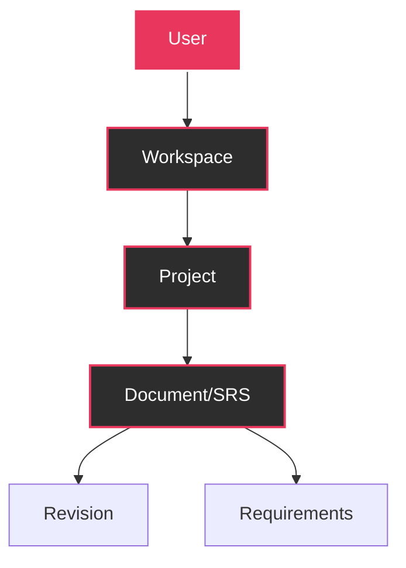

## Welcome to FSD Movil

FSD Movil is a powerful mobile-first platform designed to streamline software project management and automate the generation of technical documentation following the SRS (Software Requirements Specification) standard. Built with Flutter, it provides a seamless cross-platform experience for development teams, project managers, and stakeholders.

<Note>
  FSD Movil combines multiple tools into one unified platform, eliminating the need to switch between different applications for project tracking, documentation, and team collaboration.
</Note>

## What Problems Does FSD Movil Solve?

Traditional project management and documentation workflows are fragmented:

- **Multiple Tools**: Teams juggle separate platforms for project tracking, documentation, and collaboration
- **Manual Documentation**: Creating and maintaining SRS documents is time-consuming and error-prone
- **Versioning Challenges**: Tracking document changes and maintaining revision history requires manual effort
- **Limited Mobility**: Desktop-only solutions restrict access and flexibility

FSD Movil addresses these challenges by providing an integrated, mobile-first solution.

## Core Capabilities

<CardGroup cols={2}>
  <Card title="Project Management" icon="folder-tree" iconType="solid">
    Create and organize projects within collaborative workspaces with role-based access control
  </Card>
  <Card title="SRS Documentation" icon="file-contract" iconType="solid">
    Generate professional SRS documents with structured forms and real-time preview
  </Card>
  <Card title="Real-time Collaboration" icon="users-line" iconType="solid">
    Enable team members to work simultaneously with change tracking and approval workflows
  </Card>
  <Card title="Version Control" icon="clock-rotate-left" iconType="solid">
    Maintain complete revision history with the ability to compare and restore previous versions
  </Card>
</CardGroup>

## Key Features

### Workspace Organization

Organize your teams and projects into workspaces with granular permission controls:

- **Administrator**: Full control over workspace settings, members, and projects
- **Editor**: Create and modify projects and documents
- **Viewer**: Read-only access to projects and documentation

### Automated SRS Generation

FSD Movil transforms the tedious process of creating SRS documents:

<Steps>
  <Step title="Structured Input">
    Fill out organized forms for requirements, use cases, and system specifications
  </Step>
  <Step title="Live Preview">
    View your document in real-time as you enter information
  </Step>
  <Step title="Export">
    Generate professional DOCX files ready for delivery to stakeholders
  </Step>
</Steps>

### Visual Diagrams

Automatically generate technical diagrams:

- **Sequence Diagrams**: Visualize system interactions and workflows
- **Entity-Relationship Diagrams**: Document database structure and relationships

All diagrams are rendered using Mermaid syntax for easy editing and version control.

### Multi-Platform Support

Built with Flutter, FSD Movil runs natively on:

<Tabs>
  <Tab title="Mobile">
    - **Android**: Version 5.0 (API 21) and above
    - **iOS**: iOS 12.0 and above
    - Full touch-optimized interface
    - Offline capabilities
  </Tab>
  <Tab title="Desktop">
    - **Windows**: Windows 10 and above
    - **macOS**: macOS 10.14 and above
    - **Linux**: Modern distributions
    - Native desktop integration
  </Tab>
  <Tab title="Web">
    - Modern browsers (Chrome, Firefox, Safari, Edge)
    - Progressive Web App (PWA) support
    - No installation required
  </Tab>
</Tabs>

## Technology Stack

FSD Movil is built on a modern, robust technology foundation:

<CodeGroup>
```yaml pubspec.yaml
dependencies:
  # Core Framework
  flutter:
    sdk: flutter
  
  # State Management
  flutter_riverpod: ^2.6.1
  
  # Routing & Navigation
  go_router: ^14.6.2
  
  # HTTP Client
  dio: ^5.7.0
  
  # Local Storage
  shared_preferences: ^2.3.3
```

```dart main.dart
import 'package:flutter/material.dart';
import 'package:flutter_riverpod/flutter_riverpod.dart';
import 'package:fsdmovil/router/app_router.dart';

void main() {
  WidgetsFlutterBinding.ensureInitialized();
  runApp(const ProviderScope(child: MyApp()));
}

class MyApp extends StatelessWidget {
  const MyApp({super.key});

  @override
  Widget build(BuildContext context) {
    return MaterialApp.router(
      title: 'FSD',
      theme: ThemeData(
        useMaterial3: true,
        colorScheme: const ColorScheme.dark(
          primary: Color(0xFFE8365D),
        ),
      ),
      routerConfig: appRouter,
    );
  }
}
```
</CodeGroup>

### Architecture Highlights

<AccordionGroup>
  <Accordion title="State Management with Riverpod" icon="atom">
    FSD Movil uses Riverpod for predictable, testable state management. Riverpod provides:
    
    - Compile-time safety with no runtime errors
    - Easy testing without complex mocking
    - Built-in caching and automatic disposal
    - Provider composition for complex state logic
  </Accordion>
  
  <Accordion title="Declarative Routing with GoRouter" icon="route">
    Navigation is handled by GoRouter, offering:
    
    - Type-safe navigation with code generation
    - Deep linking support for mobile and web
    - Custom page transitions (slide, fade, etc.)
    - Route guards for authentication flows
  </Accordion>
  
  <Accordion title="RESTful API Integration" icon="plug">
    Dio powers all HTTP communications:
    
    - Interceptors for JWT token injection
    - Automatic request/response transformation
    - Built-in retry logic and error handling
    - Configurable timeouts and base URLs
  </Accordion>
  
  <Accordion title="Secure Authentication" icon="shield-check">
    JWT-based authentication with:
    
    - Secure token storage using SharedPreferences
    - Automatic token refresh
    - Biometric authentication support (planned)
    - Session persistence across app restarts
  </Accordion>
</AccordionGroup>

## Project Structure

FSD Movil follows a clean, organized architecture:

```
lib/
├── main.dart                     # Application entry point
├── config/
│   ├── app_config.dart           # Environment configuration
│   └── api_routes.dart           # API endpoint definitions
├── providers/
│   └── auth_provider.dart        # Authentication state
├── router/
│   └── app_router.dart           # Route configuration
├── screens/
│   ├── login_screen.dart         # Login interface
│   ├── register_screen.dart      # Registration interface
│   └── dashboard_screen.dart     # Main dashboard
└── services/
    ├── api_service.dart          # HTTP client wrapper
    └── auth_service.dart         # Authentication logic
```

<Tip>
  The codebase is designed for maintainability and scalability. Each layer has a single responsibility, making it easy to test and extend.
</Tip>

## Data Model

FSD Movil organizes data in a hierarchical structure:



- **User**: Individual team member with authentication credentials
- **Workspace**: Collaborative environment containing multiple projects
- **Project**: Software project with associated documentation
- **Document (SRS)**: Requirements specification with structured content
- **Revision**: Version snapshot of a document
- **Requirement**: Individual functional or non-functional requirement

## Who Should Use FSD Movil?

<CardGroup cols={3}>
  <Card title="Development Teams" icon="laptop-code">
    Track requirements, manage documentation, and collaborate on technical specifications
  </Card>
  <Card title="Project Managers" icon="user-tie">
    Oversee project progress, review documentation, and manage team access
  </Card>
  <Card title="Technical Writers" icon="pen-to-square">
    Create and maintain SRS documents with structured forms and version control
  </Card>
</CardGroup>

## Getting Started

Ready to dive in? Follow these steps:

<CardGroup cols={2}>
  <Card title="Installation" icon="download" href="/installation">
    Set up Flutter, clone the repository, and install dependencies
  </Card>
  <Card title="Quick Start" icon="rocket" href="/quickstart">
    Configure your environment and run the app in minutes
  </Card>
</CardGroup>

<Note>
  FSD Movil is under active development. Check the [GitHub repository](https://github.com/elchinito24/fsdmovil) for the latest updates and to contribute.
</Note>

## Next Steps

<Steps>
  <Step title="Install Dependencies">
    Follow the [installation guide](/installation) to set up Flutter and project dependencies
  </Step>
  <Step title="Configure Environment">
    Set up your API endpoint and build configuration
  </Step>
  <Step title="Run the App">
    Launch FSD Movil on your preferred platform
  </Step>
  <Step title="Explore Features">
    Learn about [authentication](/features/authentication), [workspaces](/features/workspaces), and [SRS documentation](/features/srs-documents)
  </Step>
</Steps>
